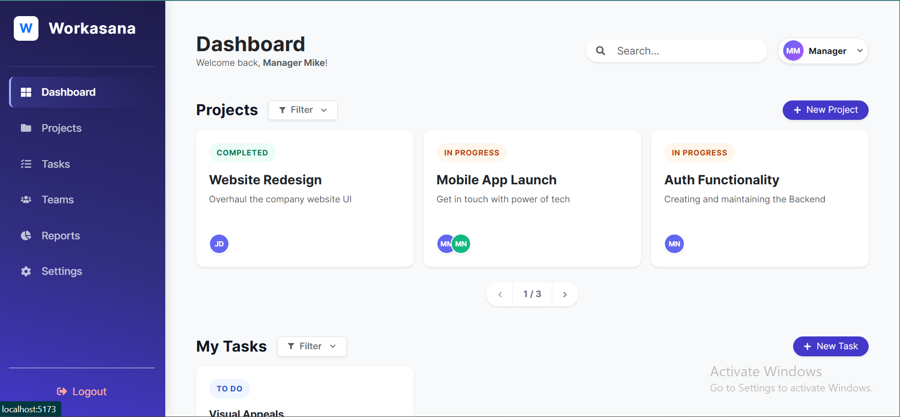

# 💼 Workasana - Project & Task Management Suite

[](https://reactjs.org/)
[](https://nodejs.org/)
[](https://www.mongodb.com/)
[](https://zustand-demo.pmnd.rs/)
[](https://vercel.com/)

Workasana is a full-stack, enterprise-grade project management application designed to help teams organize workspaces, track individual tasks, and visualize productivity. Built using the MERN stack (MongoDB, Express, React, Node.js), it features a highly relational database architecture, a mesmerizing Glassmorphism UI, and real-time Chart.js analytics.

 <!-- Save your screenshot in a docs folder -->

## Live Demo
- **Frontend**: [https://workasana-client.vercel.app](https://workasana-client.vercel.app/) 
- **Backend API**: [https://workasana-api.onrender.com](https://workasana-api.onrender.com/) 

## Demo Video
Watch a walkthrough of all major features of this app:<br>
[Watch Video Demo](https://drive.google.com/file/d/...) *(Replace with your link)*

## Quick Start

Follow these steps to set up the project locally.

### 1. Clone the Repository
```bash
git clone https://github.com/MuqeemNasir/Workasana.git
cd Workasana

# Setup Backend
cd backend
npm install
npm run dev

# Setup Frontend
cd ../frontend
npm install
npm run dev
```

<br>

# Tech Stack

- *Frontend*: React (Vite), React Router DOM v6, Zustand (State Management), Axios, Bootstrap 5, Chart.js, React-Toastify.
- *Backend*: Node.js, Express.js, Zod (Validation), CORS, JSON Web Tokens (JWT), Bcrypt.js.
- *Database*: MongoDB Atlas with Mongoose ODM.
- *Tools*: Picocolors (Custom Logger), Git.

<br>

# Features
## 🎨 Mesmerizing UI/UX (Discovery)

- Showcases a premium Glassmorphism design system on Auth pages.
- Features a responsive, off-canvas sliding mobile drawer for seamless navigation.
- Utilizes CSS transitions and hover-lift effects on custom cards to make interactions feel fluid.

## 📂 Workspace Engine (Projects & Teams)
- Create dynamic Projects and Teams with detailed descriptions.
- Assign multiple registered users to a single Team via a custom multi-select modal.
- Track Project status automatically based on the completion rate of underlying tasks.

## ✅ Task Management
- Create tasks with specific Due Dates, Time Estimates, and Custom Tags.
- Assign tasks to multiple owners with overlapping avatar UI.
- Filter tasks globally or project-specifically by Status (To Do, In Progress, Completed, Blocked).
- Sort projects and tasks dynamically (Newest, Oldest, A-Z).

## 📊 Analytics & Reporting (Super Feature)
- Calculates "Pending Days of Work" across the entire organization.
- Visualizes "Total Work Done Last 7 Days" using Bar Charts.
- Groups and displays "Tasks Closed by Team/Owner" using dynamic Doughnut and Pie charts.

## Folder Structure
```
Workasana/
├── backend/
│   ├── controllers/
│   ├── middleware/
│   ├── models/
│   ├── routes/
│   ├── utils/
│   └── index.js
└── frontend/
    ├── src/
    │   ├── components/
    │   ├── pages/
    │   ├── services/
    │   ├── stores/
    │   └── utils/
    └── App.jsx
```
## Contact
For bugs or feature requests, please reach out to mac786m@gmail.com